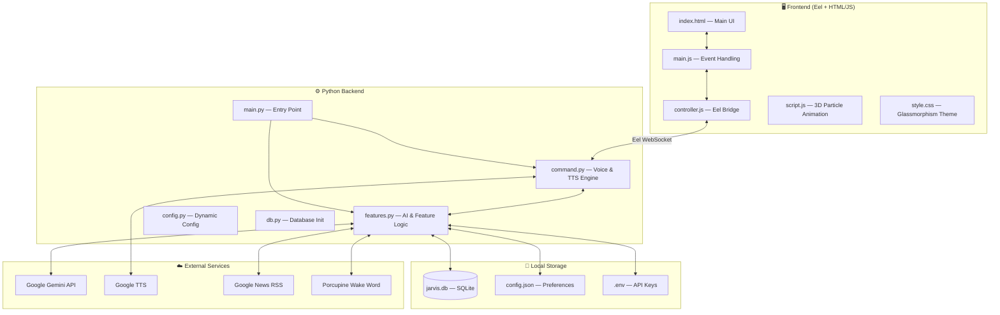

<div align="center">

# 🤖 JARVIS — AI-Powered Desktop Assistant

LIVE DEMO : https://jarvis-b51s93g7r-raj-pithavas-projects.vercel.app/

**A voice-controlled, AI-powered desktop assistant built with Python, Eel, and Google Gemini.**

[](https://python.org)
[](https://ai.google.dev)
[](https://flask.palletsprojects.com)
[](LICENSE)


*Your personal AI assistant that understands voice commands in English, Hindi, and Gujarati.*

---

[Features](#-features) • [Architecture](#-architecture) • [Installation](#-installation) • [Configuration](#-configuration) • [Usage](#-usage) • [Tech Stack](#-tech-stack)

</div>

---

## ✨ Features

| Category | Feature | Description |
|----------|---------|-------------|
| 🎙️ **Voice Control** | Wake Word Detection | Activate with "Jarvis", "Alexa", or a custom wake word |
| 🧠 **AI Chat** | Google Gemini Integration | Natural conversation powered by Gemini 2.0 Flash |
| 🌐 **Multilingual** | Hindi, Gujarati, English | Understands and responds in native scripts |
| 🔊 **Text-to-Speech** | gTTS + pyttsx3 Fallback | Multiple voice accents (Indian, American, British, Australian) |
| 📺 **YouTube** | Voice-controlled Playback | "Play [song] on YouTube" |
| 📱 **WhatsApp** | Desktop Messaging | Send WhatsApp messages via voice commands |
| 📸 **Camera** | Photo Capture | Take pictures using your webcam |
| 🖥️ **System Control** | Lock / Shutdown / Restart | Full system control via voice |
| 🔇 **Volume Control** | Up / Down / Mute | Hands-free volume adjustment |
| 📰 **News** | Live Headlines | Fetches latest news from Google News RSS |
| 📊 **System Monitor** | CPU / RAM / Battery | Real-time system stats in the UI |
| 🎨 **Customizable** | Theme & Wake Word | Change colors, accent, and wake word from Settings |
| ⏰ **Task Scheduler** | Scheduled Actions | Schedule emails and reminders |
| 🗑️ **Recycle Bin** | Empty Trash | Voice-controlled recycle bin cleanup |
| 📷 **Screenshots** | Screen Capture | Take screenshots with voice commands |

---

## 🏗️ Architecture



---

## 📋 Prerequisites

Before you begin, ensure you have the following installed:

- **Python 3.10+** — [Download](https://www.python.org/downloads/)
- **pip** — Comes with Python
- **Microsoft Edge or Chrome** — For the Eel GUI
- **Microphone** — For voice commands
- **Google Gemini API Key** — [Get one free](https://aistudio.google.com/apikey)

### Optional

- **Porcupine Access Key** — For built-in wake word detection ([Get key](https://picovoice.ai/))
- **WhatsApp Desktop** — For WhatsApp messaging feature
- **Webcam** — For camera/photo features

---

## 🚀 Installation

### 1. Clone the Repository

```bash
git clone https://github.com/YOUR_USERNAME/JARVIS.git
cd JARVIS/JARVIS
```

### 2. Create a Virtual Environment

```bash
python -m venv envjarvis
```

**Activate it:**

```bash
# Windows
envjarvis\Scripts\activate

# macOS/Linux
source envjarvis/bin/activate
```

### 3. Install Dependencies

```bash
pip install -r requirements.txt
```

> **Note:** PyAudio may require additional setup on some systems. On Windows, you may need to install it from a wheel file if `pip install pyaudio` fails.

### 4. Set Up Environment Variables

```bash
copy .env.example .env
```

Open `.env` and add your Gemini API key:

```env
GEMINI_API_KEY=your_actual_api_key_here
```

### 5. Initialize the Database

```bash
python engine/db.py
```

### 6. Run JARVIS

```bash
python run.py
```

Or use the batch file:

```bash
start.bat
```

---

## ⚙️ Configuration

### Settings Panel (In-App)

Click the ⚙️ gear icon in the bottom-right of the UI to access:

| Setting | Options | Description |
|---------|---------|-------------|
| **Theme Color** | Color Picker | Changes the accent color of the entire UI |
| **Voice Accent** | Indian, American, British, Australian | Changes the English TTS accent |
| **Wake Word** | Any word | Custom wake word (requires restart) |

### Adding System Commands

In the Settings → **System** tab, add shortcuts:

| Keyword | Path |
|---------|------|
| `notepad` | `C:\Windows\notepad.exe` |
| `chrome` | `C:\Program Files\Google\Chrome\Application\chrome.exe` |
| `vscode` | `C:\Users\YOU\AppData\Local\Programs\Microsoft VS Code\Code.exe` |

### Adding Web Commands

In the Settings → **Web** tab, add quick-open URLs:

| Keyword | URL |
|---------|-----|
| `youtube` | `https://www.youtube.com` |
| `github` | `https://www.github.com` |
| `chatgpt` | `https://chat.openai.com` |

---

## 🎯 Usage

### Voice Commands

| Say this... | JARVIS does... |
|-------------|---------------|
| *"Open notepad"* | Launches Notepad |
| *"Play Believer on YouTube"* | Plays the song on YouTube |
| *"Take a screenshot"* | Captures your screen |
| *"What's the news?"* | Reads top 3 headlines |
| *"Lock the system"* | Locks your PC |
| *"Volume up"* / *"Mute"* | Controls system volume |
| *"Empty the recycle bin"* | Cleans up trash |
| *"Who is Elon Musk?"* | AI-powered answer |

### Text Input

Type your command in the text field and press **Enter** or click the **Send** button.

### Keyboard Shortcut

Press **Win + J** to activate JARVIS without clicking.

---

## 📁 Project Structure

```
JARVIS/
├── JARVIS/
│   ├── engine/
│   │   ├── auth/                    # Face recognition (experimental)
│   │   │   ├── haarcascade_frontalface_default.xml
│   │   │   ├── recoganize.py
│   │   │   ├── sampler.py
│   │   │   ├── trainer.py
│   │   │   ├── samples/             # Face samples
│   │   │   └── trainer/             # Trained models
│   │   ├── command.py               # Voice recognition & TTS
│   │   ├── config.py                # Dynamic configuration
│   │   ├── db.py                    # Database initialization
│   │   ├── features.py              # Core AI & features
│   │   └── helper.py                # Utility functions
│   ├── www/
│   │   ├── assets/
│   │   │   ├── audio/start_sound.mp3
│   │   │   ├── image/logo.ico
│   │   │   └── vendor/textillate/
│   │   ├── backend.py               # Flask REST API
│   │   ├── controller.js            # Eel bridge functions
│   │   ├── dbconnection.js          # DB connection helpers
│   │   ├── index.html               # Main UI
│   │   ├── main.js                  # UI event handling
│   │   ├── script.js                # 3D animation & CRUD
│   │   └── style.css                # Glassmorphism theme
│   ├── .env                         # API keys (gitignored)
│   ├── .env.example                 # Environment template
│   ├── .gitignore                   # Git ignore rules
│   ├── config.json                  # User preferences
│   ├── main.py                      # Application entry
│   ├── requirements.txt             # Python dependencies
│   ├── run.py                       # Multi-process launcher
│   ├── start.bat                    # Windows quick-start
│   └── device.bat                   # ADB device setup
├── config.json                      # Root config
└── README.md                        # This file
```

---

## 🛠️ Tech Stack

| Layer | Technology |
|-------|-----------|
| **Frontend** | HTML5, CSS3, JavaScript, jQuery 3.6 |
| **UI Framework** | Eel (Python ↔ JS bridge) |
| **CSS Design** | Glassmorphism, CSS Animations |
| **Backend** | Python 3.10+, Flask |
| **AI Engine** | Google Gemini 2.0 Flash |
| **Voice** | SpeechRecognition, gTTS, pyttsx3 |
| **Wake Word** | Porcupine (Picovoice) |
| **Database** | SQLite3 |
| **System Control** | pyautogui, psutil, ctypes |
| **Animations** | SiriWave, Textillate, Canvas Particles |

---

## 🔐 Security

This project follows security best practices:

- ✅ API keys stored in `.env` file (never committed to Git)
- ✅ Input sanitization to prevent XSS and command injection
- ✅ Flask debug mode disabled in production
- ✅ CORS restricted to localhost
- ✅ Parameterized SQL queries to prevent SQL injection
- ✅ Comprehensive `.gitignore` covering all sensitive files

---

## 🤝 Contributing

Contributions are welcome! Here's how:

1. **Fork** the repository
2. **Create** a feature branch: `git checkout -b feature/amazing-feature`
3. **Commit** your changes: `git commit -m 'Add amazing feature'`
4. **Push** to the branch: `git push origin feature/amazing-feature`
5. **Open** a Pull Request

---

## 📄 License

This project is licensed under the MIT License — see the [LICENSE](LICENSE) file for details.

---

## 🙏 Acknowledgements

- [Google Gemini](https://ai.google.dev) — AI conversation engine
- [Eel](https://github.com/python-eel/Eel) — Python-JS bridge
- [Picovoice Porcupine](https://picovoice.ai/) — Wake word detection
- [SiriWave](https://github.com/nicedoc/siriwave) — Voice animation
- [Textillate](https://textillate.js.org/) — Text animations

---

<div align="center">

**Built with ❤️ by [RAJ PANCHAL]**

⭐ Star this repo if you found it useful!

</div>
